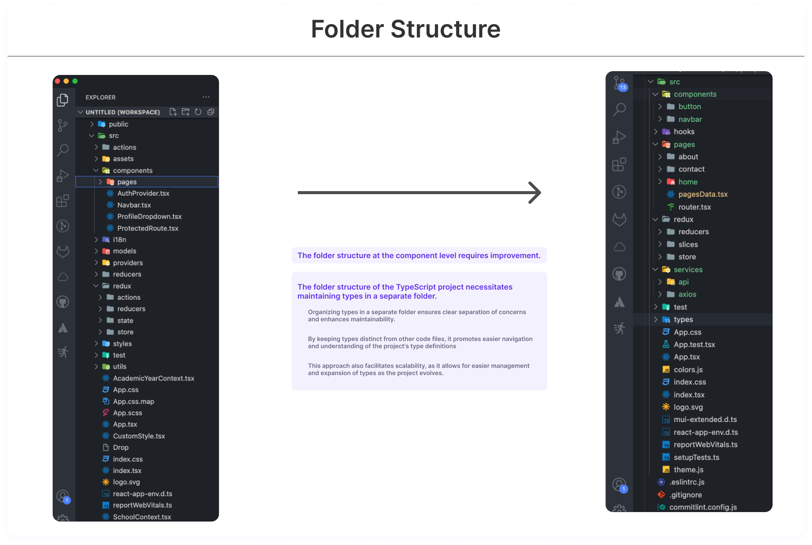
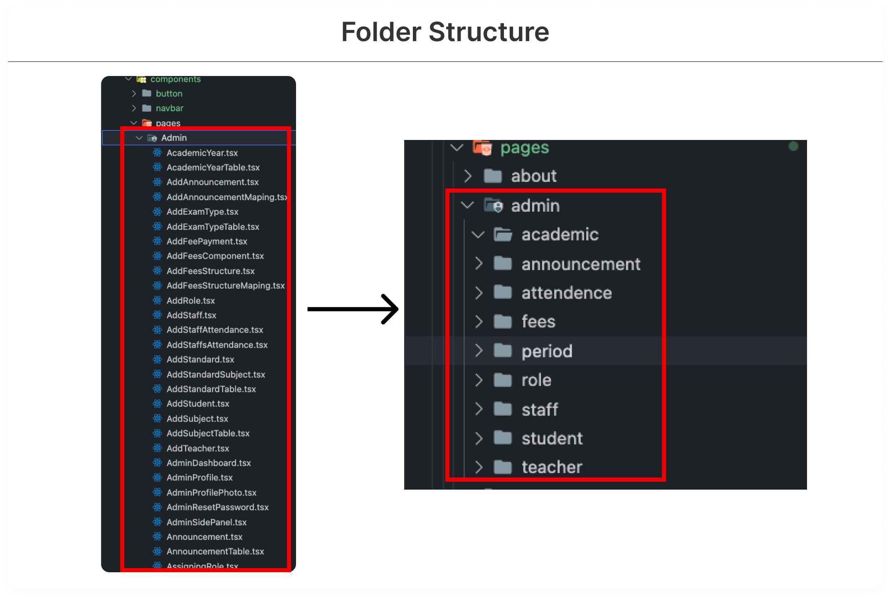

# Folder Structrure

### The folder structure of the TypeScript project necessitates maintaining types in a separate folder.

1. Organizing types in a separate folder ensures clear separation of concerns and enhances maintainability.
2. By keeping types distinct from other code files, it promotes easier navigation and understanding of the project's type definitions.
3. This approach also facilitates scalability, as it allows for easier management and expansion of types as the project evolves.

## Folder Structure - Components

