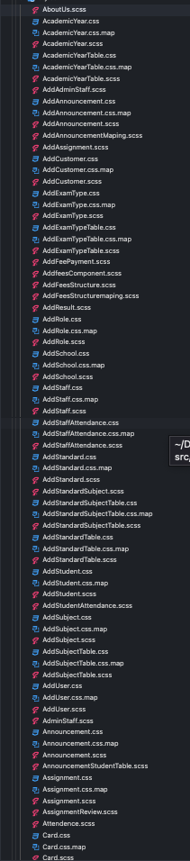

# Fix this style folder

This is hard to maintain:

1.  As mentioned in custom style guide we can achive the styling: https://eduflowdocs.netlify.app/project/customstyles/customs

2.  Override the theme to ensure consistent UI across all components and pages: https://eduflowdocs.netlify.app/eduflow/color

👇 Fix 👇 ------ Follow above point 1 and point 2 ----- 👇 Fix 👇

